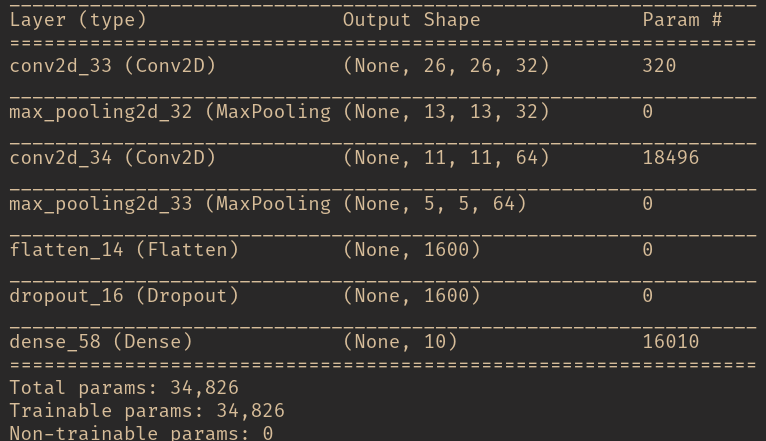

# MNIST WebApp

Github pages deployment of a simple machine learning model that uses MNIST database for digit recognition using TensorFlow.js

## Instructions


### Model development

- In order to play with the machine learning model use `jupyter-notebook`.



**Figure 1.** Model summary table. 

### Frontend development

Make sure you have installed first [`npm`](https://www.npmjs.com/get-npm) and then [`yarn`](https://yarnpkg.com/getting-started/install) before proceeding.

In order to check the correct installation of all these packages open a terminal and type

```
npm -v
node -v
yarn -v
```

Then do the following

```sh
cd frontend
yarn install
yarn start
```

## Deployment

The webapp is deployed at [https://mattborghi.github.io/mnist-webapp/](https://mattborghi.github.io/mnist-webapp/)
